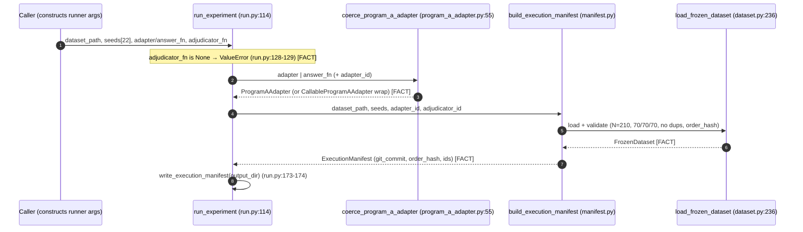
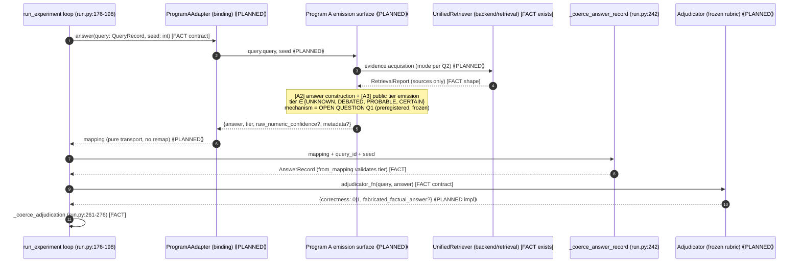

# PROGRAM A — SEQUENCE DIAGRAM (EXP-1 execution path)

**Authority:** Chief Systems Architect design review, 2026-07-07.
Every participant and message below is either **[FACT]** (verified in code at
the cited line) or **[PLANNED]** (the missing component, per
`PROGRAM_A_BINDING_SPEC.md`). Nothing else is depicted.

Legend: solid participants exist and are tested; `⟪PLANNED⟫` participants do
not exist yet.

---

## 1. Per-experiment setup



## 2. Per-query loop (inside each of the 22 seed replicates)



## 3. Per-seed close-out and experiment decision

```mermaid
sequenceDiagram
    autonumber
    participant Runner as run_experiment (run.py:189-221)
    participant Eval as build_evaluated_records (dataset.py:352)
    participant Dec as decide_seed (decision.py)
    participant ECE as compute_ece (calibration.py:102)
    participant XDec as decide_experiment (decision.py)
    participant Rep as report.py / artifact_specs.py [FACT exists, NOT wired — TD-05]

    Runner->>Eval: queries, answers, correctness, fabricated flags
    Eval-->>Runner: EvaluatedRecord[] (label spaces joined, never inferred) [FACT]
    Runner->>Dec: evaluated, seed, protocol_violation
    Dec->>ECE: records → tier→p_i (0.125/0.375/0.625/0.875), 4 locked bins
    ECE-->>Dec: CalibrationResult (ece, bins) [FACT]
    Note over Dec: six kill checks: N≥200, ECE<0.10, tier-independence (α=0.05),<br/>≥2 tiers, 0 CERTAIN-fabrications, protocol_violation [FACT]
    Dec-->>Runner: SeedDecision → seed_<seed>/{answers,evaluated,decision}
    Runner->>XDec: 22 seed record-sets
    XDec-->>Runner: ExperimentDecision (any seed kill ⇒ kill; pooled = report-only) [FACT]
    Runner--xRep: (not invoked today — reliability.csv / calibration_report.md missing) [FACT TD-05]
```

---

**[FACT]** Every solid element is verified wired (`EXP1_TRACE.md` Links 2, 4,
5, 6a-b). **[FACT]** The three `⟪PLANNED⟫` participants (emission surface,
binding, adjudicator) plus the frozen dataset are exactly the four MISSING
links of `EXP1_TRACE.md` Verdict items 1-4. **[FACT]** The `Rep` dead-end is
TD-05 and must be wired before a compliant run.
