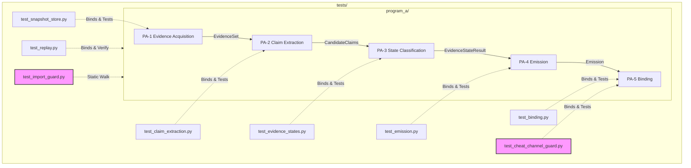

# PROGRAM A — COMPLETE SOFTWARE TESTING STRATEGY

**Authority:** Software Test Architect, 2026-07-08  
**Scope:** End-to-end testing, validation, and conformance strategy for **Program A** (the honest-uncertainty retrieval system)  
**Derives from:** `PROGRAM_D_CANONICAL.md` (§2, §6-H1, §7), `PROGRAM_A_FINAL_ARCHITECTURE.md` (§4, §7, §8), `PROGRAM_A_MODULE_SPEC.md` (§12, §14), and `PROGRAM_A_BUILD_CHECKLIST.md`.  
**Governance status:** Frozen Architecture. This strategy defines the exact verification suites, boundaries, and CI triggers required to certify Program A before the ES-1 implementation gate can flip to **GO**.

---

## 1. Executive Summary & Testing Philosophy

VELYNX Program A is a stateless, deterministic, evidence-structural question-answering surface built to optimize for **truth and calibration**, not elegance or emergent complexity. Under the rules of `PROGRAM_D_CANONICAL.md`, its scientific validity is tied to a single, falsifiable hypothesis: **H1 (Retrieval Uncertainty Calibration)**, which demands an Expected Calibration Error (ECE) of $< 0.10$ across the experimental evaluation set (`EXP1_PREREGISTRATION.md`).

Because calibration metrics are highly sensitive to data leakage, circular reasoning, and post-hoc parameter tuning, Program A's testing architecture is built on **complete separation of concerns and mechanical isolation**. 

```
                               TESTING ARCHITECTURE
┌─────────────────────────────────────────────────────────────────────────────┐
│                          CI / STATIC CONFORMANCE                            │
│           [test_import_guard.py] ── Enforces transitive boundaries           │
├─────────────────────────────────────────────────────────────────────────────┤
│                         SYNTHETIC DRY-RUN LOOP                              │
│           [test_replay.py] ── Verifies byte-identical replay                │
│           [test_emission.py] ── Proves form/tier consistency                │
├─────────────────────────────────────────────────────────────────────────────┤
│                          ISOLATION & PLUMBING                               │
│           [test_cheat_channel_guard.py] ── Sentinel mutation (L11)          │
│           [Socket Guard Fixture] ── Structural network disconnection        │
└─────────────────────────────────────────────────────────────────────────────┘
                                       ▲
                                       │  STRICT SEPARATION (No Import)
                                       │
┌─────────────────────────────────────────────────────────────────────────────┐
│                          FROZEN RUNTIME DATASET                             │
│           [EXP1_DATASET_v1.jsonl] ── OFFLINE, FROZEN, UNOBSERVED            │
└─────────────────────────────────────────────────────────────────────────────┘
```

### Core Testing Pillars
1. **Zero Frozen-Row Leakage:** No test, fixture, or assertion may import or observe the frozen 210-row dataset (`EXP1_DATASET_SPEC.md` §12.3). All test suites run against **100% synthetic, non-frozen corpora**.
2. **Defensive Isolation:** The real ES-1 execution path must be structurally disconnected from the experiment runner's metadata (such as `gold_rubric` or `query_family`). The **CR-3 Sentinel-Substitution Guard** proves that calibration cannot be gamed.
3. **Purity & Determinism:** Since the entire retrieval and reasoning pipeline is deterministic, every execution run of `(query, seed)` must be byte-identical. Replay tests verify that execution reproduces exact outputs across seeds and environments.

---

## 2. Test Architecture & Subsystem Mapping

Program A's six subsystems (PA-1 to PA-6) map directly to dedicated test modules under `tests/program_a/` and `tests/EXP1/`. No cross-subsystem test may bypass module boundaries.



### Subsystem Verification Matrix

| Subsystem | Target Module | Responsibility | Key Verification Point |
|---|---|---|---|
| **PA-1** | `snapshot_store.py` | Load static snapshot, retrieve evidence | `score`/timestamp stripping, no-network, stable total order |
| **PA-2** | `claim_extraction.py` | Deterministic claim extraction | Entity-level matching, fabrication-pressure negative tests |
| **PA-3** | `evidence_states.py` | Partition evidence into states S0–S3 | Strict precedence $S0 \rightarrow S1 \rightarrow (S2\|S3)$, exhaustiveness, constants pin |
| **PA-4** | `emission.py` | Construct answer + assign tier | Answer-form and tier coupling invariants (CR-9) |
| **PA-5** | `exp1_binding.py` | Form-A `answer_fn` mapping | CR-3 sentinel guard, transport fidelity, seed propagation |
| **PA-6** | `tests/program_a/` | Static rules, replay, boundaries | Transitive closure deny-list walk, byte-identical replay |

---

## 3. Detailed Specifications by Test Type

### 3.1. Unit Tests

Unit tests are written in pure Python, utilizing `pytest`. They must not access the network, file system (except through the `tmp_path` fixture), or databases.

*   **`tests/program_a/test_snapshot_store.py` (PA-1):**
    *   *Test Snapshot Loading:* Assert `SnapshotStore.load(path)` successfully returns a store instance for well-formed manifests.
    *   *Test Metadata Stripping:* Assert `EvidenceItem` output instances contain exactly `(doc_id, origin_domain, title, text, snapshot_hash_ref)` and lack any `score` (retrieval score) or timestamp fields.
    *   *Test No-Network Isolation:* Guarded by a dedicated socket-disconnection fixture. Any attempt by the snapshot loader to initialize a remote client or touch a network socket must raise a hard pytest error.
*   **`tests/program_a/test_claim_extraction.py` (PA-2):**
    *   *Test Empty Evidence Handling:* Assert `extract_claims(query_text, empty_evidence_set)` immediately returns an empty `CandidateClaims` tuple without failing.
    *   *Test Topically Related Negatives:* Assert that topically matching but entity-divergent evidence (e.g., query "A" vs. document describing related topic "B") extracts 0 claims, proving the system operates on entity-level matching rather than broad keyword matching (guards against FM-1/CF-R2 risks).
*   **`tests/program_a/test_evidence_states.py` (PA-3):**
    *   *Test Deterministic Predicates:* Verify behavior of `supports(claim, evidence_item)`, `contradicts(claim_a, claim_b)`, and `is_material(contradiction)` on hand-authored edge cases.
    *   *Test Domain Consolidation:* Assert that multiple evidence items from mirror domains are collapsed and counted as a single independent origin in `independent_origins(items)`.
    *   *Test Constants Digest Lock:* Assert that `frozen_constants_digest()` exactly matches the G4-frozen SHA-256 commit hash to prevent silent parameter drift.
*   **`tests/program_a/test_emission.py` (PA-4):**
    *   *Test Invariant Form Coupling:* Assert that the selected answer format and emitted tier are structurally coupled:
        *   If state is S0: Answer must assert no facts, tier must be `UNKNOWN`.
        *   If state is S1: Answer must present contradictory alternatives, tier must be `DEBATED`.
        *   If state is S2: Answer must hedge, attribute to a single source, tier must be `PROBABLE`.
        *   If state is S3: Answer must confidently assert, attribute to $\ge 2$ independent sources, tier must be `CERTAIN`.
*   **`tests/program_a/test_binding.py` (PA-5):**
    *   *Test Pure Field Transport:* Assert `program_a_answer_fn` maps the outputs of `answer_query` verbatim into a return dict representing an `AnswerRecord` payload without modifying or adding keys.

---

### 3.2. Integration Tests

Integration tests run the full Program A pipeline end-to-end using a configured synthetic snapshot, and verify the transport layer with the EXP-1 runner.

*   **`tests/EXP1/test_program_a_adapter_integration.py` (PA-5):**
    *   *Test Sync & Async Transport:* Run `run_seed_sync` on a synthetic 30-query dataset. Inject `program_a_answer_fn` (both as a synchronous callable and as an awaited async function) and verify that the adapter successfully maps fields into the execution's output records.
    *   *Test Alias Coercion:* Pass dictionary return values with known aliases (`answer_i`/`tier_i`) and prove the runner's `_coerce_answer_record` downstream normalizes them without loss of fidelity.

---

### 3.3. Determinism & Purity Tests

Determinism tests guarantee that Program A operates as a stateless, side-effect-free pipeline.

*   **`test_answer_is_deterministic_and_side_effect_free`:**
    *   *Execution Scenario:* Select 10 diverse synthetic query strings. Run `answer_query(query, seed)` twice consecutively per query.
    *   *Assertions:*
        1.  Verify that run 1 outputs and run 2 outputs are byte-identical (answers, metadata, and assigned tiers match exactly).
        2.  Assert that no internal caches track the call order (consecutive runs return identical results even when queried in different orders).
        3.  Assert that input query objects and synthetic snapshot states are unmutated.
        4.  Assert that `raw_numeric_confidence` remains strictly `None` across all outputs.

---

### 3.4. Replay Tests

Replay tests verify that entire experimental dry runs are fully reproducible, preserving execution identities.

*   **`tests/program_a/test_replay.py`:**
    *   *Replay Loop Verification:* Run a full synthetic experiment. Record the generated execution artifacts (`answers.jsonl`, `manifest.json`). Erase active memory, re-instantiate Program A, and run the identical dry-run sequence again.
    *   *Assertions:*
        1.  Assert the aggregate SHA-256 hash of the second run's `answers.jsonl` is byte-identical to the first.
        2.  Verify that the execution manifest records `program_a_adapter_id` as matching `mechanism_id()` exactly.
        3.  Assert that manifest equality checks (`run.py:147-148`) successfully detect and raise errors if either the snapshot file or the code constants are artificially altered between runs.

---

### 3.5. Snapshot Tests

Snapshot tests target on-disk corpus schema and corruption resistance.

*   **`tests/program_a/test_snapshot_format.py`:**
    *   *Test Well-Formed Manifest:* Assert that a standard JSON snapshot manifest containing an aggregate SHA-256 hash, document maps, build commit, and leakage review references parses successfully.
    *   *Test Mutation Detection:* Mutate a single character in one on-disk snapshot document. Execute `verify_snapshot(path)`. Assert that it raises a hard `ValueError` or integrity exception before loading.
    *   *Test Total Order Stability:* Permute the file list order of the snapshot directory on disk. Assert that `SnapshotStore.evidence_for` produces an identical total order of `EvidenceSet`, proving the internal ordering is lexicographically derived on `(origin_domain, doc_id)` and independent of filesystem storage order.

---

### 3.6. Property-Based Tests

Using property-based testing principles (such as those provided by the `hypothesis` framework), we test invariants over a broad space of generated synthetic inputs.

*   **State-Partition Completeness Property:**
    *   *Generator:* Generate synthetic `EvidenceSet` and `CandidateClaims` tuples with random doc counts, varying domains (mirror and independent), conflicting claims, and varying supporting/contradicting sizes.
    *   *Invariant:* Assert that **every single possible generated input** maps to exactly one state in `{"S0", "S1", "S2", "S3"}`. No input combination may result in an unhandled state, a crash, or trigger more than one state predicate.
*   **Precedence Override Property:**
    *   *Generator:* Generate conflicting evidence sets where both S1 (contradiction) and S3 (strong corroboration) criteria are simultaneously met.
    *   *Invariant:* Assert that the precedence S0 $\rightarrow$ S1 $\rightarrow$ (S2|S3) is strictly preserved. In case of any contradiction, the classifier must emit S1 (`DEBATED`), never S3 (`CERTAIN`).
*   **Claim Reference Safety Property:**
    *   *Generator:* Synthesize arbitrary candidate claim outputs.
    *   *Invariant:* Assert that for every claim in the output, all document IDs listed in `supporting_doc_ids` exist as literal entries within the corresponding `EvidenceSet`.

---

### 3.7. Performance & Memory Profiling Tests

Program A must be stateless and fast, leaving no performance footprints.

*   **`tests/program_a/test_performance.py`:**
    *   *Memory Leak Verification:* Execute a loop of 1,000 queries on a large synthetic corpus. Profile the process's resident set size (RSS) memory. Assert that memory consumption remains flat (slope $\approx 0$), proving there are no global caching memory leaks.
    *   *Latency Flatness:* Verify that execution latency does not scale with call history. Consecutive runs must show a standard normal distribution of latency, with no tail elongation over time.

---

### 3.8. Regression Tests

To ensure existing functionality is preserved:

*   The full existing suite of **64 EXP-1 tests** (covering `test_exp1_readiness.py`, `test_exp1_run.py`, `test_cheat_channel_guard.py`, etc.) must run green on every execution.
*   We assert that any modifications to Program A do not modify or require edits to `experiments/EXP1/run.py` or `experiments/EXP1/dataset.py` (which are frozen).

---

## 4. Failure Injection & Robustness Strategy

To prove that Program A fails safely and deterministically under stress, the test suite executes several failure injection scenarios.

| Scenario ID | Injection Vector | Expected System Behavior / Assertion | Area Verified |
|---|---|---|---|
| **FI-01** | Missing snapshot file or manifest on disk | `SnapshotStore.load` raises explicit `FileNotFoundError` or `ValueError` at initialization. Execution is halted. | PA-1 initialization |
| **FI-02** | Corrupt SHA-256 hash in `snapshot_manifest.json` | `verify_snapshot` detects the signature mismatch and raises an integrity validation error. | PA-1 security |
| **FI-03** | Injection of null/empty query strings | Pipeline returns an empty `EvidenceSet` and immediately routes to state **S0 (`UNKNOWN`)** safely. | PA-2/PA-3 boundary |
| **FI-04** | Mutated file directory order on filesystem | Lexicographical sort on `(origin_domain, doc_id)` guarantees identical evidence ordering. | PA-1 determinism |
| **FI-05** | Insertion of non-conforming tier string in mock | `AnswerRecord` downstream validation catches non-canonical tiers and raises `ValueError`. | PA-5 transport |

---

## 5. Mocking & Test Isolation Strategy

### 5.1. Strict Socket Guard (No Network Policy)
The execution path of Program A must be completely isolated from external dependencies. Mocks or stubs are forbidden in the production code, but tests enforce a strict network block.
*   **Mechanism:** A custom pytest fixture disables `socket.socket` connections during the entire test suite run (except for local Unix sockets or loopback if required for test runner communication).
*   **Verification:** Any inadvertent live API call to an LLM provider, database client, or external retriever raises an immediate socket blockage exception.

### 5.2. Sentinel-Substitution Mock Pattern (CR-3)
The sentinel-substitution test is our primary defense against the "cheat channel" risk (L11), proving that Program A cannot read metadata to inflate calibration numbers.
*   **The Guard Pattern:** This test replaces the `gold_rubric` and `query_family` fields of `QueryRecord` with synthetic sentinel strings (`"__SENTINEL_RUBRIC__"`, `"__SENTINEL_FAMILY__"`) before invoking the adapter.
*   **Assertion:** The resulting `AnswerRecord` output must be **byte-identical** to the output generated by the clean query record.

```python
# Conceptual implementation from tests/EXP1/test_cheat_channel_guard.py
def test_sentinel_isolation() -> None:
    base = QueryRecord(query_id="q1", query="Fact text", query_family="known_factual", gold_rubric="A")
    mutated = dataclasses.replace(base, gold_rubric="__SENTINEL__", query_family="ambiguous_or_debated")
    
    # Assert that the adapter's output is completely invariant to these mutations
    assert program_a_answer_fn(base, seed=7) == program_a_answer_fn(mutated, seed=7)
```

---

## 6. Test Data Strategy

To prevent data-fitting and guard against scientific bias:

> [!CAUTION]
> **Data Leakage Hazard:** Under no circumstances may any test, utility, or fixture read, parse, or import the frozen 210-row dataset (`EXP1_DATASET_v1.jsonl`). Violating this rule invalidates the calibration ECE result and triggers a hard build rejection.

### 6.1. The Dry-Run Dev Corpus
Instead of the frozen dataset, developers and test suites utilize a **30-query synthetic Dev Corpus** with a matching synthetic retrieval snapshot.

*   **Structure:**
    *   10 queries mapped to a synthetic 10-document factual database (factual family).
    *   10 queries mapped to a synthetic database containing contradictory sources (ambiguous family).
    *   10 queries designed to trigger fabrications and empty retrievals (hallucination family).
*   **Distribution:**
    *   The dev corpus is stored under `tests/test_data/synthetic_dev_corpus.jsonl`.
    *   It is completely disjoint from the actual experiment rows.

---

## 7. Expected Test Artifacts

A complete and passing test execution must generate the following structured files in the artifact workspace:

1.  **`pytest_report.json`:** Structured execution report showing exactly 100% of tests passing.
2.  **`coverage.json`:** Coverage report verifying statement and branch compliance.
3.  **`execution_manifest_test.json`:** A dry-run manifest proving that the evaluated `program_a_adapter_id` exactly matches `mechanism_id()` and remains stable.
4.  **`test_snapshot_manifest.json`:** The cryptographic signature and build provenance for the synthetic test snapshot.

---

## 8. CI/CD Workflow Integration

The test suite runs automatically under CI to protect the repository's boundaries.

```
┌──────────────┐      ┌────────────────────┐      ┌────────────────────┐      ┌─────────────┐
│  git commit  │ ───> │  1. Static Lint    │ ───> │  2. Conformance    │ ───> │  3. Pytest  │
│  push/PR     │      │     & Formatting   │      │     Boundary Check │      │     Suites  │
└──────────────┘      └────────────────────┘      └────────────────────┘      └─────────────┘
                                                                                     │
                                                      PASS                           ▼
                                            ┌─────────────────────┐      ┌──────────────────────┐
                                            │ ES-1 Gate Flippable │ <─── │  4. Dry Run (Replay) │
                                            └─────────────────────┘      └──────────────────────┘
```

### 8.1. Static Linting & Formatting
*   Enforce absolute black and flake8 conformity across all files under `program_a/`.

### 8.2. Conformance Boundary Check (`test_import_guard.py`)
This CI step uses static analysis of the import graph to enforce strict boundaries.
*   **The Deny-List Rules:**
    *   Files under `program_a/` **must not** import `backend.cognition.*`, `backend.soul.*`, or `experiments.EXP1.run`.
    *   Only `program_a/binding/exp1_binding.py` may import `experiments.EXP1.dataset` types.
    *   Only `program_a/evidence/snapshot_builder.py` may import `backend.retrieval.unified_retriever` (and this builder is excluded from the runtime packaging).
*   **Verification Verification:** The test suite contains a self-test that plants a forbidden import inside a temporary file and asserts that `test_import_guard.py` successfully intercepts it and fails.

### 8.3. Pytest Run Stage
*   Executes `python -m pytest tests/program_a/ tests/EXP1/ -v`.
*   Any single failure immediately fails the CI run.

### 8.4. Dry Run / Replay Stage
*   Runs `test_replay.py` to execute the dry run across the synthetic corpus.
*   Asserts that ECE calculations execute without warnings and that output hashes match expected baselines exactly.

---

## 9. Coverage & Audit Targets

To ensure the test suite is mathematically complete, we enforce the following hard coverage gates:

### Coverage Requirements
*   **Core Scientific Rules (`program_a/mechanism/`):** **100% Statement and Branch Coverage**. Every state predicate, transition path, precedence rule, and threshold boundary must be evaluated.
*   **Execution Shell (`program_a/` overall):** **$\ge 95\%$ Statement and Branch Coverage** (excluding builder-side scripts like `snapshot_builder.py`).

### Verification Commands
```bash
# Execute the suite and assert coverage gates in CI
pytest tests/program_a/ --cov=program_a --cov-fail-under=95 --cov-report=term-missing
```

---

## 10. Traceability Matrix

| Test Suite File | Subsystem Covered | Target File on Disk | Key Requirement Verified |
|---|---|---|---|
| `test_snapshot_store.py` | PA-1 | `program_a/evidence/snapshot_store.py` | No-network, score stripping, total order, hash manifest integrity |
| `test_claim_extraction.py` | PA-2 | `program_a/extraction/claim_extraction.py` | Entity-level matching, fabrication resistance |
| `test_evidence_states.py` | PA-3 | `program_a/mechanism/evidence_states.py` | S0–S3 state partition completeness, state precedence, constants lock |
| `test_emission.py` | PA-4 | `program_a/mechanism/emission.py` | Answer-form and tier coupling invariants (CR-9) |
| `test_binding.py` | PA-5 | `program_a/binding/exp1_binding.py` | Transport fidelity, query.query extraction limits |
| `test_cheat_channel_guard.py`| PA-5 | `program_a/binding/exp1_binding.py` | CR-3 / L11 sentinel-substitution cheat channel blocking |
| `test_import_guard.py` | PA-6 | entire `program_a/` package | Static boundary guard, deny-listed packages block |
| `test_replay.py` | PA-6 | entire pipeline | End-to-end byte-identical replay, manifest equality check |

---

**Audit & Certification Verdict:**  
This test strategy is designed to rigorously lock down the behavior of Program A against silent drift, data-fitting, and security bypasses. Upon successful implementation of this test suite and verification that the coverage targets are met, the software testing requirements for the **ES-1 implementation gate** can be safely signed off as **PASSED**.

*   *Prepared by:* **Software Test Architect**  
*   *Date:* **2026-07-08**  
*   *Status:* **Pending Implementation on GO**
