# Program C — Variable Dependency Graph

```mermaid
%%{
  init: {
    'theme': 'base',
    'themeVariables': {
      'primaryColor': '#1a237e',
      'primaryTextColor': '#fff',
      'primaryBorderColor': '#0d47a1',
      'lineColor': '#78909c',
      'secondaryColor': '#004d40',
      'tertiaryColor': '#4a148c',
      'fontFamily': 'monospace'
    }
  }
}%%

graph TB
    subgraph FOUNDATION["Foundation Layer — Hyperparameters & Inputs"]
        direction LR
        ALPHA["α (Dirichlet concentration)"]
        ETA_BASE["η_base (base learning rate)"]
        HM["H_m (stability half-maturity)"]
        TAU_FRAC["τ_frac (fracture threshold 0.85)"]
        CONF0["conf₀ (bootstrap confidence)"]
        EPS_FLOOR["ε_floor (epsilon floor)"]
        THETA_BIRTH["θ_birth (birth threshold 0.5)"]
        TOBS["T_obs (observation horizon)"]
        THETA_PROX["θ_prox (proximity threshold)"]
        KMAX["K_max (cluster budget)"]
        FMULT["f_mult (focus multiplier)"]
        SF["sf (suppress floor)"]
        B["b (bits per value)"]
        SMAX["S_max (surprise ceiling)"]
        ALPHA_ACC["α_acc (EWMA acc)"]
        ALPHA_SURP["α_surp (EWMA surp)"]
        ALPHA_DEC["α_dec (EWMA decay)"]
        LAMBDA_E["λ (H weight 1.0)"]
        MU_E["μ (S weight 2.0)"]
        NU_E["ν (A weight 0.5)"]
        E_EXHAUST["E_exhaust (18.0 au)"]
        H_HIGH["H_high (2.0 bits)"]
        S_HIGH["S_high (0.50 du)"]
        P_HIGH["P_high (1.0)"]
        TOL["tol (tolerance 0.0)"]
        ALPHA_W["α_w₀ (Beta prior)"]
        BETA_W["β_w₀ (Beta prior)"]
        LAMBDA_UPD["λ_upd (0.15)"]
        Q_SRC["q_src (source quality)"]
        T_INTERVAL["τ_interval (500 ticks)"]
        P_ENTER["P_enter (20 anomalies)"]
        P_EXIT["P_exit (10 anomalies)"]
        T_COOLDOWN["τ_cooldown (50 ticks)"]
    end

    subgraph RAW_OBS["Observation Stream"]
        direction LR
        C["c (context)"]
        S["s (symbol)"]
        V["v (sensory vector)"]
        HIDDEN["h (hidden state)"]
        STREAM_RAW["raw sensor stream"]
    end

    subgraph SYMBOLIC["Symbolic Domain — Dirichlet-Markov"]
        direction TB
        N_CS["n(c,s) (successor count)"]
        NC["N(c) (total mass)"]
        SUPP["|support| (vocab size)"]
        P_S_C["P(s|c) (predictive prob)"]
        IS["I(s) (Shannon surprisal)"]
        AS["a(s) (attention weight)"]
        HP["H(p) (prediction entropy)"]
        MNOVEL["m_novel (novelty mass)"]
        SUPP_PRED["supp_pred (predicted support)"]
        CONF["conf (rule confidence)"]
        SUPP_CNT["support_count (rule support)"]
        CONTR_CNT["contradiction_count"]
        STB["stb (stability)"]
        PHI["φ (fracture ratio)"]
        EPS["ε (prediction error)"]
        DELTA["δ (confidence delta KL)"]
        ETA_EFF["η_eff (effective learning rate)"]
    end

    subgraph CONCEPT_BIRTH["Concept Birth Domain"]
        direction TB
        T["T (total events)"]
        R["R (rule confirmations)"]
        E_SET["{e_i} (exception counts)"]
        E_MASS["E (total exception mass)"]
        FI["f_i (exception freq)"]
        R_OVER_T["R/T (rule mass)"]
        E_OVER_T["E/T (concept mass)"]
        H_WITHIN["H_within (within-concept entropy)"]
        H_BEFORE["H_before (before-concept entropy)"]
        H_COARSE["H_coarse (coarse entropy)"]
        H_AFTER["H_after (after-concept entropy)"]
        LAMBDA_MODEL["λ_model (model cost)"]
        G["G (compression gain)"]
    end

    subgraph VECTOR["Continuous Vector Domain"]
        direction TB
        D_V1V2["d(v₁,v₂) (Euclidean distance)"]
        DW["d_w(a,b) (weighted Euclidean)"]
        MU_K["μ_k (centroid)"]
        NK["n_k (cluster count)"]
        THETA_ADAPT["θ_adapt (adaptive threshold)"]
        S_VEC["S (spatial surprise)"]
        RHO["ρ (surprise rate)"]
        T_IJ["T(i→j) (Markov transitions)"]
        WD["w_d (attention weight vector)"]
        K["k (latent variable arity)"]
        PG["PG (prediction gain)"]
        CG["CG (compression gain MDL)"]
        ST_TIGHT["ST (stability/tightness)"]
        SCORE["Score (combined score)"]
        COV["cov (coverage)"]
        FPR["FPR (false positive rate)"]
    end

    subgraph TELEMETRY["Cognitive Telemetry / CPI"]
        direction TB
        ACC["acc (EWMA accuracy)"]
        MU_SURP["μ_surp (EWMA surprise)"]
        DEC["dec (decay score)"]
        CR["CR (compression ratio)"]
        C_RES["C_res (contradictions resolved)"]
        AT["A_t (accuracy trend)"]
        DT["D_t (surprise decay)"]
        COMP_COMP["compression_component"]
        RES_COMP["resolution_component"]
        CPI["CPI (Cognitive Progress Index)"]
    end

    subgraph FREE_ENERGY["Free Energy Domain"]
        direction TB
        H_ENT["H (transition entropy)"]
        S_SPATIAL["S (spatial surprise)"]
        A_LOAD["A (active load)"]
        V_ANOM["V_anom (anomaly volume)"]
        E_COG["E (cognitive energy)"]
        REGIME["Regime (OPTIMAL/LEARNING/EXHAUSTION)"]
    end

    subgraph DECISION["Decision Policy Domain"]
        direction TB
        E_BEFORE["E_before"]
        E_AFTER["E_after"]
        DELTA_S["ΔS"]
        DELTA_H["ΔH"]
        DELTA_A["ΔA"]
        DELTA_E["ΔE"]
        MERGE_ACCEPT["Merge Accept/Reject"]
    end

    subgraph LIVING_EDGES["Living Edge Domain"]
        direction TB
        ALPHA_W_VAR["α_w (Beta alpha)"]
        BETA_W_VAR["β_w (Beta beta)"]
        W_ASYM["w_asym (asymptotic weight)"]
        MU_W["μ_w (Bayesian weight mean)"]
        N_PLUS["n_plus (reinforced count)"]
        N_MINUS["n_minus (challenged count)"]
        N_EV["n_ev (evidence count)"]
        GAMMA["γ (challenge rate)"]
        EPISTEMIC["Epistemic Status"]
    end

    subgraph SCHEDULER["Memory Scheduler"]
        direction LR
        CONSOLIDATE["Consolidation Trigger"]
    end

    %% === DATA FLOW EDGES ===

    %% Symbolic domain dependencies
    N_CS --> P_S_C
    NC --> P_S_C
    ALPHA --> P_S_C
    SUPP --> P_S_C
    C --> N_CS
    C --> NC
    S --> N_CS

    P_S_C --> IS
    P_S_C --> AS
    P_S_C --> HP
    P_S_C --> MNOVEL
    P_S_C --> SUPP_PRED
    P_S_C --> DELTA

    IS --> EPS
    IS --> ACC
    IS --> MU_SURP
    IS --> DEC

    ETA_BASE --> ETA_EFF
    HM --> STB
    SUPP_CNT --> STB
    SUPP_CNT --> PHI
    CONTR_CNT --> PHI
    SUPP_CNT --> CONF
    CONTR_CNT --> CONF
    STB --> ETA_EFF
    ETA_EFF --> CONF
    CONF0 --> CONF

    %% Concept birth dependencies
    T --> R_OVER_T
    T --> E_OVER_T
    T --> FI
    R --> R_OVER_T
    R --> H_BEFORE
    E_SET --> E_MASS
    E_SET --> FI
    E_SET --> H_WITHIN
    E_SET --> H_BEFORE
    E_MASS --> H_WITHIN
    E_MASS --> E_OVER_T
    E_MASS --> H_COARSE
    R_OVER_T --> H_BEFORE
    R_OVER_T --> H_COARSE
    E_OVER_T --> H_COARSE
    E_OVER_T --> G
    H_WITHIN --> G
    LAMBDA_MODEL --> H_AFTER
    LAMBDA_MODEL --> G
    H_COARSE --> H_AFTER
    H_AFTER --> G
    H_BEFORE --> G
    SUPP --> LAMBDA_MODEL
    TOBS --> LAMBDA_MODEL
    G --> CONF
    G --> C_RES
    THETA_BIRTH --> CONF

    %% Vector domain dependencies
    V --> D_V1V2
    V --> S_VEC
    V --> MU_K
    V --> NK
    D_V1V2 --> THETA_ADAPT
    D_V1V2 --> S_VEC
    MU_K --> S_VEC
    NK --> MU_K
    S_VEC --> RHO
    S_VEC --> THETA_ADAPT
    THETA_ADAPT --> RHO
    FMULT --> WD
    SF --> WD
    WD --> DW
    D_V1V2 --> DW
    D_V1V2 --> COV
    COV --> PG
    FPR --> PG
    K --> CG
    B --> CG
    CG --> SCORE
    PG --> SCORE
    ST_TIGHT --> SCORE

    %% Markov chain
    NK --> T_IJ
    V --> T_IJ
    T_IJ --> H_ENT

    %% Telemetry dependencies
    SMAX --> ACC
    ALPHA_ACC --> ACC
    IS --> ACC
    ACC --> AT
    IS --> MU_SURP
    ALPHA_SURP --> MU_SURP
    IS --> DEC
    ALPHA_DEC --> DT
    DEC --> DT
    AT --> CPI
    DT --> CPI
    CR --> COMP_COMP
    C_RES --> RES_COMP
    COMP_COMP --> CPI
    RES_COMP --> CPI

    %% Free energy dependencies
    H_ENT --> E_COG
    S_VEC --> E_COG
    NK --> A_LOAD
    V_ANOM --> A_LOAD
    A_LOAD --> E_COG
    S_VEC --> S_SPATIAL
    LAMBDA_E --> E_COG
    MU_E --> E_COG
    NU_E --> E_COG
    E_COG --> REGIME
    E_EXHAUST --> REGIME
    H_HIGH --> REGIME
    S_HIGH --> REGIME
    P_HIGH --> REGIME

    %% Decision policy dependencies
    E_COG --> E_BEFORE
    E_COG --> E_AFTER
    E_BEFORE --> DELTA_E
    E_AFTER --> DELTA_E
    S_SPATIAL --> DELTA_S
    H_ENT --> DELTA_H
    A_LOAD --> DELTA_A
    DELTA_E --> MERGE_ACCEPT
    DELTA_S --> MERGE_ACCEPT
    DELTA_H --> MERGE_ACCEPT
    DELTA_A --> MERGE_ACCEPT
    TOL --> MERGE_ACCEPT

    %% Living edge dependencies
    ALPHA_W --> ALPHA_W_VAR
    BETA_W --> BETA_W_VAR
    ALPHA_W_VAR --> MU_W
    ALPHA_W_VAR --> N_PLUS
    BETA_W_VAR --> MU_W
    BETA_W_VAR --> N_MINUS
    N_PLUS --> N_EV
    N_MINUS --> N_EV
    N_MINUS --> GAMMA
    N_EV --> GAMMA
    MU_W --> EPISTEMIC
    N_EV --> EPISTEMIC
    GAMMA --> EPISTEMIC
    LAMBDA_UPD --> W_ASYM
    Q_SRC --> ALPHA_W_VAR
    Q_SRC --> BETA_W_VAR

    %% Scheduler
    NK --> CONSOLIDATE
    T_INTERVAL --> CONSOLIDATE
    P_ENTER --> CONSOLIDATE
    P_EXIT --> CONSOLIDATE
    T_COOLDOWN --> CONSOLIDATE

    %% === CIRCULAR FEEDBACK LOOPS (highlighted) ===
    linkStyle 3,4,5,6,7 stroke:#ff5252,stroke-width:3px,stroke-dasharray:5 5
    subgraph CIRCULAR_LOOPS["⚠ Circular Feedback Loops"]
        CL1["① Attention → Cluster → Attention: w_d → μ_k → latent cause → w_d"]
        CL2["② Concept Birth → Probation → Exceptions: G → concept birth → probation → reclassification → H_before/H_within → G"]
        CL3["③ Free Energy → Merge → Clusters → Free Energy: E → merge → μ_k/n_k → H/S/A → E"]
        CL4["④ Adaptive Threshold: S → θ_adapt → anomaly flag → cluster → S"]
        CL5["⑤ Score → Cause Promotion: Score → latent cause → attention → cluster → Score"]
    end

    %% Style definitions
    classDef foundation fill:#37474f,color:#fff,stroke:#546e7a
    classDef raw fill:#1a237e,color:#fff,stroke:#283593
    classDef symbolic fill:#004d40,color:#fff,stroke:#00695c
    classDef concept fill:#b71c1c,color:#fff,stroke:#c62828
    classDef vector fill:#e65100,color:#fff,stroke:#ef6c00
    classDef telemetry fill:#4a148c,color:#fff,stroke:#6a1b9a
    classDef energy fill:#01579b,color:#fff,stroke:#0277bd
    classDef decision fill:#33691e,color:#fff,stroke:#558b2f
    classDef living fill:#3e2723,color:#fff,stroke:#5d4037
    classDef scheduler fill:#263238,color:#fff,stroke:#37474f
    classDef loops fill:#ff5252,color:#fff,stroke:#ff1744,stroke-width:2px

    class ALPHA,ETA_BASE,HM,TAU_FRAC,CONF0,EPS_FLOOR,THETA_BIRTH,TOBS,THETA_PROX,KMAX,FMULT,SF,B,SMAX,ALPHA_ACC,ALPHA_SURP,ALPHA_DEC,LAMBDA_E,MU_E,NU_E,E_EXHAUST,H_HIGH,S_HIGH,P_HIGH,TOL,ALPHA_W,BETA_W,LAMBDA_UPD,Q_SRC,T_INTERVAL,P_ENTER,P_EXIT,T_COOLDOWN foundation
    class C,S,V,HIDDEN,STREAM_RAW raw
    class N_CS,NC,SUPP,P_S_C,IS,AS,HP,MNOVEL,SUPP_PRED,CONF,SUPP_CNT,CONTR_CNT,STB,PHI,EPS,DELTA,ETA_EFF symbolic
    class T,R,E_SET,E_MASS,FI,R_OVER_T,E_OVER_T,H_WITHIN,H_BEFORE,H_COARSE,H_AFTER,LAMBDA_MODEL,G concept
    class D_V1V2,DW,MU_K,NK,THETA_ADAPT,S_VEC,RHO,T_IJ,WD,K,PG,CG,ST_TIGHT,SCORE,COV,FPR vector
    class ACC,MU_SURP,DEC,CR,C_RES,AT,DT,COMP_COMP,RES_COMP,CPI telemetry
    class H_ENT,S_SPATIAL,A_LOAD,V_ANOM,E_COG,REGIME energy
    class E_BEFORE,E_AFTER,DELTA_S,DELTA_H,DELTA_A,DELTA_E,MERGE_ACCEPT decision
    class ALPHA_W_VAR,BETA_W_VAR,W_ASYM,MU_W,N_PLUS,N_MINUS,N_EV,GAMMA,EPISTEMIC living
    class CONSOLIDATE scheduler
    class CL1,CL2,CL3,CL4,CL5 loops
```

## Graph Legend

| Color | Domain | File(s) |
|-------|--------|---------|
| Blue-gray | Foundation / Hyperparameters | various |
| Dark blue | Observation Stream | environment.py |
| Dark green | Symbolic Domain | cognitive_core.py |
| Red | Concept Birth | concept_birth.py |
| Orange | Vector Domain | vector_prediction_core.py, latent_cause_engine.py |
| Purple | Telemetry / CPI | cognitive_telemetry.py |
| Light blue | Free Energy | validation/metrics.py |
| Light green | Decision Policy | decision_policy.py |
| Brown | Living Edges | living_edges.py |
| Dark gray | Memory Scheduler | memory_scheduler.py |
| Red dashed | Circular Feedback Loops | multiple |

## Edge Types

- Solid arrows: direct data flow dependency
- Red dashed arrows (linkStyle): circular / feedback dependencies

## Files

- Graph source: `research/program_c_variable_dependency_graph.md`
- Full provenance: `research/program_c_variable_provenance.md`
- Ontology source: `research/program_c_mathematical_ontology.md`
