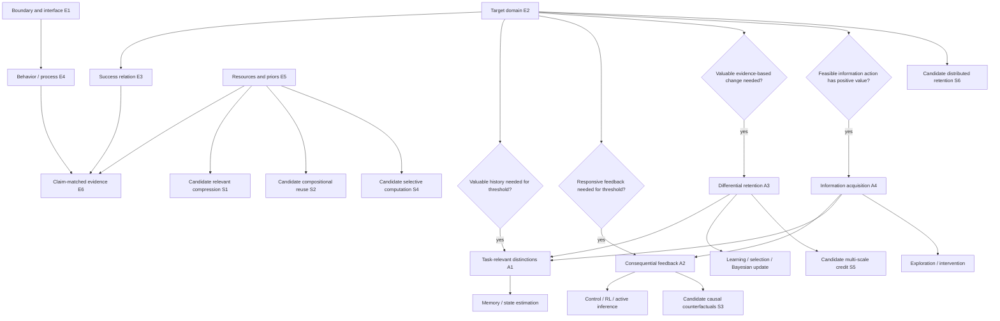

# Theory Landscape: Computational Principles of Intelligence

**Status:** Critical literature synthesis, version 1.0  
**Date:** 2026-07-20  
**Scope:** Implementation-independent computational claims about intelligence  
**Epistemic status:** Review and reduction, not a new hypothesis or amendment to `PROGRAM_D_CANONICAL.md`

## Executive conclusion

The literature does not support a single, unconditional computational mechanism as necessary and sufficient for intelligence. It supports a weaker and more precise conclusion:

> Intelligence claims are scope-relative: they concern competence on a declared problem, class, sequence, or distribution under a stated success relation. Resource bounds are essential when the claim concerns efficiency, adaptation, or fair comparison. Computational requirements are conditional on that declared scope.

The review therefore uses a **claim-specification checklist**, not an unconditional basis or cognitive architecture:

1. a system boundary and information/output interface;
2. a target problem, class, sequence, or distribution;
3. a success predicate, constraint, partial order, loss, utility, or viability region;
4. a behavior or process being evaluated;
5. resources and prior information when efficiency or comparison is claimed; and
6. evidence matched to the claim, which may be formal, exhaustive, online, intervention-based, held out, or independently replicated.

For demanding classes of adaptive, interactive tasks, four overlapping functional obligations recur:

1. preserve task-relevant distinctions;
2. couple outputs to consequences through feedback;
3. retain changes that improve the declared criterion; and
4. acquire information when passive observations do not resolve decision-relevant uncertainty.

These obligations are too weak to be sufficient. More familiar candidates, including prediction, Bayesian inference, reward maximization, compression, representation, embodiment, compositionality, and self-modeling, are derived, scope-dependent, or implementation-level rather than established universal primitives.

## 1. Method and standard of evidence

### 1.1 Question decomposition

The mission question, "What are the minimal computational principles required for intelligence to emerge?", contains terms that must be separated:

- **Required** may mean logically necessary, necessary for a declared task class, practically necessary under resource bounds, or merely common in known implementations.
- **Intelligence** may mean passive prediction, problem solving, adaptive learning, interactive agency, autonomous viability, or population-level cumulative competence.
- **Emerge** may mean appearance during development, increase without direct specification of each behavior, spontaneous macroscopic order, or merely successful learning. These are not equivalent.
- **Minimal** requires a declared reduction criterion. Logical non-derivability, causal separability, and explanatory non-redundancy are different standards.

For distributional studies of adaptive competence, this review uses the following operational target:

> A system exhibits intelligence to degree `I` relative to task distribution `D`, resource regime `B`, prior information `K`, and score `U` when it reliably attains comparatively high prospectively evaluated performance and adapts efficiently to relevant variation in `D`.

A useful abstract form is:

```text
pi(y_t | h_t)                     behavioral transduction
V(tau, pi, B, K) = E[U_tau]       task-relative performance
I(D, pi, B, K) = E_tau~D[V]       distribution-relative competence
```

`h_t` is the information history available at the chosen system boundary. This notation does not require an internal history store; an implementation may use current input, internal memory, body dynamics, external traces, tools, or other agents. It is one useful formalization, not a definition covering singleton problems, worst-case classes, adversarial sequences, constraint satisfaction, or exhaustive finite evaluation.

### 1.2 Classification

| Class | Meaning |
|---|---|
| Fundamental | Follows from the possibility of discriminable, evaluated performance, with no commitment to a particular implementation. |
| Conditionally fundamental | Necessary for a specified task class or resource regime, but has counterexamples outside it. |
| Derived | Follows from an objective, probability model, loss, task structure, or resource assumption. |
| Implementation hypothesis | One possible realization; alternatives can produce the same behavior. |
| Descriptive framework | Organizes phenomena but does not alone make a risky causal prediction. |

### 1.3 Evidence rules

- A constructive success establishes sufficiency only for the tested task class, not necessity.
- A behavioral equivalence cannot identify an internal mechanism without interventions or resource constraints.
- A mathematical optimality result is conditional on its objective, model class, prior, and computational assumptions.
- A biological correlate does not establish a substrate-independent principle.
- A theory that can fit any result after changing priors, losses, precision, or system boundaries is not strongly tested.
- A negative result against one implementation does not falsify the abstract principle unless the implementation spans the claim.

### 1.4 Coverage, search method, and limits

This is a **selective conceptual synthesis**, not a systematic review. It began from the theory families named in the P1 brief and repository, followed foundational and critical primary sources for each family, and added adjacent work when the reduction exposed a dependency. Sources were included when they proposed a substrate-independent principle, supplied a necessity or sufficiency result, or directly challenged one. Architecture variants without a distinct principle were generally excluded.

The sampled map covers automata and computability, cybernetics and control, decision theory and reinforcement learning, Bayesian inference, predictive processing, active inference, information theory, MDL and universal induction, symbolic and causal approaches, dynamical, embodied, ecological, and enactive approaches, metacognition and workspace theories, evolution and development, and collective intelligence. No database protocol, fixed search strings, citation-network stopping rule, or exhaustive screening was used. Literature-level conclusions are limited to these sampled theories. Formal learning, control, ecological and enactive cognition, evolutionary theory, autonomy, and distributed computation warrant deeper systematic reviews.

## 2. Boundary results before theory comparison

### 2.1 No distribution-free intelligence

No Free Lunch results show that, under uniform averaging over unrestricted objective classes, optimization procedures have equal average performance [L6]. A useful agent must exploit non-uniform structure. That structure enters through the task distribution, prior, representation, body, training history, or resource allocation.

**Consequence:** no computational rule can be superior across every possible environment without assumptions. "General" must always name a scope.

### 2.2 Information cannot be recovered when it is unavailable

If two situations produce identical accessible histories but require incompatible outputs, no policy can be correct in both. Memory helps only if an earlier observation contained the missing distinction [L7]. Randomization can distribute error but cannot create information.

**Consequence:** task-relevant distinguishability, not internal memory as such, is the necessity.

### 2.3 Computability and tractability impose ceilings

Some well-defined problems are undecidable [L1]. Others, including broad planning classes, are computationally intractable even when computable [L8]. Universal decision agents such as AIXI are idealized and uncomputable [L19].

**Consequence:** theories making realizability, efficiency, adaptation-rate, or fair-comparison claims should report performance-resource frontiers rather than only ideal optimality. Pure correctness theorems need not.

### 2.4 Behavior underdetermines mechanism

If two implementations realize the same `pi(y_t | h_t)`, no implementation-independent behavioral measure can decide whether either explicitly predicts, represents, infers, compresses, or reasons symbolically. Mechanistic claims require interventions, process traces tied to predictions, or resource-scaling tests.

**Consequence:** many proposed universal principles are factorizations of a policy, not uniquely necessary mechanisms.

## 3. Landscape by principle family

### 3.1 Effective computation and state transformation

**Claim.** Intelligence requires lawful transformations among distinguishable physical states; universal computation provides a substrate capable of expressing arbitrary effective procedures [L1].

**Classification.** Effective transformation is fundamental but nearly definitional. Turing universality is neither necessary nor sufficient.

**Support.** Automata and computability theory precisely characterize classes of realizable transformations. Extensible memory increases formal expressive power.

**Challenges.** A universal machine with no useful program is not intelligent. Finite tasks can be solved by finite-state systems. Interactive, stochastic, analog, and embodied systems need not be usefully described as classical batch algorithms.

**Testability.** Formal realization proofs; state-minimization and memory lower bounds; behavior under state lesions.

**Reduction.** This family supplies the neutral notion of conditional transduction. It does not supply competence, objectives, learning, or generalization.

### 3.2 Cybernetic regulation

**Claim.** Closed-loop feedback uses consequences of outputs to keep controlled variables in acceptable regions. Requisite variety bounds regulation by the response distinctions available to the regulator [L2]. Under specific assumptions, an optimal simple regulator embodies a model of the regulated system [L3].

**Classification.** Feedback is conditionally fundamental for interactive regulation. Requisite variety is a derived capacity bound. The good-regulator result is conditional, not a universal requirement for explicit world models.

**Support.** Feedback control constructively rejects disturbances in machines and organisms. It predicts perturbation response and stability.

**Challenges.** Thermostats satisfy feedback without broad intelligence. Reactive controllers may regulate restricted systems without a separable simulator. Raw state counts depend on representation and can be reduced through abstraction, morphology, and environmental buffering.

**Testability.** Open-loop versus closed-loop ablations; disturbance rejection; stability margins; perturb the putative model while preserving controller capacity.

**Reduction.** Homeostasis, active perception, much of reinforcement learning, and parts of active inference instantiate closed-loop regulation with different criteria and state estimators.

### 3.3 Decision theory, reinforcement learning, and planning

**Claim.** A policy should improve cumulative outcomes under a reward, utility, viability, or preference criterion. Temporal credit assignment associates delayed effects with prior outputs [L4, L5]. Exploration acquires information needed for future decisions when its expected value exceeds its cost; formal bandit and dual-control results make the assumptions explicit [L33, L34].

**Classification.** Differential evaluation is fundamental to directed adaptation at the observer level. Internally represented reward, Bellman updates, temporal-difference learning, and particular exploration bonuses are derived implementations.

**Support.** Dynamic programming and reinforcement learning provide constructive optimality and convergence results in specified MDPs. Exploration lower bounds show that unknown alternatives cannot be learned without informative sampling.

**Challenges.** Results depend on Markov assumptions, objective specification, stationarity, and feasible computation. Reward maximization can optimize the wrong quantity. Exploration is unnecessary in known, passive, or one-shot tasks and can be irrational under irreversible risk.

**Testability.** Regret, adaptation curves, delayed-credit tasks, objective changes, irreversible traps, and matched-compute model-based versus reactive controls.

**Reduction.** Planning is expected-outcome comparison when counterfactual action sequences matter. Exploration is derived when actions change both outcomes and information.

### 3.4 Bayesian inference

**Claim.** Rational uncertainty-sensitive revision combines prior plausibility and likelihood; action should minimize expected loss under resulting uncertainty [L9].

**Classification.** Bayesian updating is normatively derived from coherence or loss assumptions, not an unconditional empirical law of intelligence. Explicit probability representation is an implementation hypothesis.

**Support.** Bayesian filtering and decision rules are exact under their specified model, prior, likelihood, and loss. Many behavioral results are quantitatively captured by Bayesian observer models. The stronger claim that Bayesianism is uniquely required by rational coherence needs additional representation assumptions not established here.

**Challenges.** Flexible priors and likelihoods permit post hoc fits. Misspecified Bayesian agents can be systematically wrong. Approximate or compiled policies can exhibit identical behavior without explicit posterior computation [L10].

**Testability.** Pre-register priors and likelihoods; manipulate evidence reliability; test calibration and trial-level predictions against non-Bayesian alternatives.

**Reduction.** Bayesian inference is one optimal update rule under uncertainty. It depends on the evaluation criterion and model class; it does not derive either.

### 3.5 Predictive processing and predictive coding

**Claim.** Hierarchical systems predict lower-level signals, update latent estimates from precision-weighted residuals, and thereby explain perception and learning [L11].

**Classification.** Prediction is conditionally useful; hierarchical predictive coding is an implementation hypothesis. Prediction-error minimization is not sufficient for intelligence.

**Support.** Predictive-coding models reproduce contextual response effects and provide local update schemes for some generative models.

**Challenges.** Expectation effects can be confounded with adaptation, attention, and discriminative computation. A reactive policy can be compiled without an identifiable online forecast. Accurate prediction does not specify what outcomes matter or which interventions should be made.

**Testability.** Separate expectation from adaptation; independently fix model hierarchy and precision; require novel quantitative predictions and causal perturbations.

**Reduction.** For specified generative models, predictive coding can approximate Bayesian inference. Sensory prediction error is not generally equal to control error or temporal-difference error.

### 3.6 Free-energy principle and active inference

**Claim.** Variational free energy bounds surprisal and supports approximate inference; expected free energy combines preference realization and epistemic value for policy selection [L12, L13].

**Classification.** Four claims must be separated: the variational identity and bound; variational inference algorithms; active inference as a process model; and the free-energy principle as a universal account of self-organizing living systems. The first is mathematical. The latter three add progressively stronger assumptions and empirical commitments. Universal claims remain contested unless system boundary, physical dynamics, model, variational family, preferences, precision, and action mapping are independently constrained.

**Support.** It unifies approximate perception and action in explicit generative models and can reproduce control and information-seeking behavior.

**Challenges.** Alternative expected-free-energy derivations and hidden assumptions exist [L13]. Markov blankets encode conditional independencies but do not by themselves settle organism boundaries or imply a particular process mechanism [L42]. Broad formulations risk redescribing any persistent system. Preferences may be fixed, learned, developmental, or evolutionary, but are not derived from prediction alone.

**Testability.** Freeze the complete generative model and alternatives before observation; compare risky policy-level predictions under preference and uncertainty manipulations.

**Reduction.** Active inference spans information state, update, control, and epistemic action across A1-A4. Under explicit restricted mappings, control-as-inference and reward-maximizing policies can coincide. This does not make their objectives, process claims, or learning semantics universally identical.

### 3.7 Information theory and relevant compression

**Claim.** Bounded systems should preserve information relevant to prediction or control while discarding irrelevant variation. Channel capacity, rate-distortion theory, and information bottleneck formulations bound achievable performance under declared source and distortion assumptions [L14, L35, L36].

**Classification.** Limited information capacity is fundamental for finite systems. Which information is relevant is derived from a task-dependent distortion or utility function.

**Support.** Shannon theory gives exact limits for declared distributions and channels. Bottleneck and sufficient-statistic formulations quantify efficient retention.

**Challenges.** Shannon information is syntactic. Maximizing information may preserve noise. Rare details can be incompressible yet decisive.

**Testability.** Rate-performance curves; memory and bandwidth interventions; compare learned states with minimal control-relevant sufficient statistics.

**Reduction.** Requisite variety, sufficient statistics, external memory, and task-relative compression describe related capacity constraints at different boundaries.

### 3.8 Minimum description length and algorithmic induction

**Claim.** Prefer models minimizing model description plus unexplained data. Universal induction weights computable hypotheses by algorithmic simplicity; AIXI adds expected-utility action selection [L15, L18, L19].

**Classification.** MDL is a derived model-selection rule. Universal induction and AIXI are conditional idealizations, not realizable universal sufficiency results.

**Support.** MDL formalizes a fit-complexity tradeoff and has consistency results under specified model and coding conditions. Algorithmic mixtures dominate broad computable predictor classes asymptotically.

**Challenges.** Results depend on coding language, reference machine, hypothesis class, reward, and horizon. Universal forms are uncomputable. Compression does not provide goals, causal semantics, or computationally feasible search.

**Testability.** Held-out or prequential codelength with coding choices fixed; latent recovery; compare equally predictive models under transfer and intervention.

**Reduction.** MDL corresponds to Bayesian model selection only under coding-prior mappings. Compression supports induction when compressible regularities are decision-relevant; it is not equivalent to understanding.

### 3.9 Symbolic and compositional computation

**Claim.** Discrete symbols, variable-role binding, and compositional rules enable productive, systematic recombination [L20, L37].

**Classification.** Explicit symbols are an implementation hypothesis. Functional compositional reuse is conditionally fundamental for open-ended systematic generalization under finite samples and memory.

**Support.** Symbolic systems constructively support theorem proving, programming, and exact variable substitution. Human cognition exhibits substantial systematicity. Controlled tests reveal failures of neural sequence systems on novel combinations [L21].

**Challenges.** Symbols alone do not solve grounding, learning, relevance, perception, or search. Finite lookup systems can solve finite benchmarks without composition. Distributed systems can implement approximate or exact compositional operations.

**Testability.** Held-out combinations, variable-role swaps, length extrapolation, productivity, and description-length scaling against memorization controls.

**Reduction.** The general principle is reusable factorization under resource pressure, not a required token format.

### 3.10 Causal inference and intervention

**Claim.** Robust action and transfer require distinguishing observation from intervention and representing invariant mechanisms [L22].

**Classification.** Intervention semantics are conditionally fundamental when tasks contain observationally equivalent but interventionally different environments. Causal graphs are one implementation.

**Support.** Structural causal models derive identifiability conditions and distinguish `P(Y|X)` from `P(Y|do(X))`.

**Challenges.** Causal structure is often unidentifiable without interventions or assumptions. Reactive policies can solve fixed environments without explicit causal models.

**Testability.** Paired environments with identical observational distributions and different intervention effects; unseen interventions; mechanism-change and transport tests.

**Reduction.** Causal inference is Bayesian or statistical inference augmented by intervention semantics and invariance assumptions. Prediction alone does not imply it.

### 3.11 Dynamical systems, ecological cognition, embodiment, and enaction

**Claim.** Adaptive behavior arises in coupled agent-body-environment dynamics; morphology and environmental structure can perform control-relevant transformations [L23, L24]. Extended approaches permit constitutive use of external resources, while sensorimotor and enactive approaches emphasize active coupling, autonomy, or sense-making [L38, L39, L40]. The stronger ecological claim of direct information pickup is not evaluated in depth here.

**Classification.** Coupling is fundamental for interactive agents. Particular attractors, bodies, and anti-representational claims are implementation hypotheses. Biological or robotic embodiment is not necessary for every intelligence scope.

**Support.** Reactive robots and dynamical models produce robust situated behavior with limited centralized models. Body dynamics demonstrably reduce controller complexity.

**Challenges.** The necessity question changes across at least five theses: physical realization, online bodily dependence, morphological computation, developmental grounding, and constitutive extension. Offline execution can challenge online-dependence claims but does not show that embodiment was unnecessary for acquisition, grounding, or objective formation. Saying every physically realized system is embodied makes the weakest claim trivial.

**Testability.** Body swaps, altered sensorimotor mappings, coupling perturbations, hysteresis, and accounting of controller complexity with and without morphological support.

**Reduction.** Some embodiment claims can be described as allocating control-relevant transformation across a wider system boundary. Radical ecological, enactive, and autopoietic accounts dispute whether computational redescription preserves the explanandum; this review does not settle that constitutive dispute. Necessity must be stated separately for execution, development, and autonomous self-maintenance.

### 3.12 Attention, global workspace, and metacognition

**Claim.** Bounded systems selectively allocate processing; global-workspace theories add broad availability to specialist processes; metacognition estimates and acts on the reliability of first-order computation [L25, L26].

**Classification.** Selective resource allocation is conditionally fundamental under binding limits. A unitary workspace and explicit confidence monitor are implementation hypotheses. Consciousness is neither established as necessary nor sufficient for task-defined intelligence.

**Support.** Capacity manipulations show benefits of selection. Global broadcasting and metacognitive accuracy have measurable neural and behavioral correlates; lesions can dissociate first-order performance from metacognitive accuracy.

**Challenges.** Late global signals can reflect report and decision rather than awareness. Confidence can be reconstructed after decisions. Many competent behaviors lack explicit self-monitoring.

**Testability.** No-report paradigms; cross-module transfer; selective-answering and calibration tests; perturb confidence while matching first-order accuracy.

**Reduction.** Attention is value-sensitive allocation of finite resources. It is not equivalent to consciousness, global broadcasting, or transformer attention.

### 3.13 Evolution, self-organization, and development

**Claim.** Local interaction can self-organize macroscopic order; heritable variation and differential reproduction change populations; developmental plasticity and intrinsic motivation construct competence over time [L27, L28, L29, L41]. Evolution can shape the inherited organization on which learning acts, rather than merely select completed policies; detailed claims about evolvability, niche construction, and evolutionary development require a broader review.

**Classification.** Selection is a population-level change principle. Self-organization and developmental mechanisms are implementation families. Order, adaptation, and intelligence must not be conflated.

**Support.** Selection and reaction-diffusion models constructively generate adaptation or organization. Learning-progress signals can produce autonomous curricula.

**Challenges.** The Price equation is an accounting identity, not a full mechanism. Spontaneous order can be nonfunctional. Intrinsic objectives can favor distractors. Evolution depends on population-environment relations, heritable variation, and differential reproduction, not necessarily an externally supplied scalar objective. Fitness may be frequency-dependent, multilevel, and altered by niche construction.

**Testability.** Lineage tracking, selection decomposition, local-rule ablation, curriculum interventions, and transfer beyond the developmental niche.

**Reduction.** Evolution and individual learning both change future variant frequencies, but differ in unit, timescale, inheritance, and credit pathway. Evolution is not constitutively required for every intelligent token. It is an etiological candidate for the origin of autonomous biological agents and their learning machinery, a claim outside the evidence needed for token-level computational necessity. This distinction is not reducible to an A3 learning update.

### 3.14 Collective and cultural intelligence

**Claim.** Social transmission, diversity, communication, and aggregation can produce capabilities exceeding those of isolated individuals [L30, L31].

**Classification.** Sociality is not necessary for individual intelligence. Transmission and cumulative retention are conditionally fundamental for cultural capabilities that exceed individual lifetime discovery.

**Support.** Transmission chains, animal traditions, diverse problem-solving groups, and distributed systems show cumulative or aggregate gains under specific conditions.

**Challenges.** Correlated error, cascades, manipulation, and conformity can make groups worse [L32]. Aggregation requires assumptions about diversity, independence, incentives, and communication.

**Testability.** Population replacement, communication removal, transmission chains, novel partners, correlated-error manipulation, and tasks exceeding individual learning budgets.

**Reduction.** Collective intelligence combines external memory, distributed inference, selection, and coordination. It is not the arithmetic mean of individual intelligence.

## 4. Equivalence and non-equivalence map

| Common identification | Defensible relationship | Why full equivalence fails |
|---|---|---|
| Prediction error = control error | Equal when a predicted signal is explicitly a reference or preferred trajectory. | Ordinary prediction can accurately forecast undesirable outcomes. |
| Prediction error = TD error | Equal for a particular value predictor with a Bellman target. | Sensory residuals and value residuals concern different variables and targets. |
| Bayesian inference = predictive coding | Some predictive-coding updates approximate Bayesian inference for particular generative models. | Bayesian inference permits many representations and algorithms. |
| Reward maximization = active inference | Policies can coincide after matching preferences, models, horizons, and epistemic terms. | Objectives, uncertainty treatment, and learning semantics are not generally identical. |
| Compression = intelligence | Compression can support induction in regular task families. | It supplies neither criterion, causal relevance, action, nor tractable search. |
| MDL = Bayesian model selection | Coding-prior correspondences connect them. | The mapping depends on model and coding assumptions. |
| Requisite variety = channel capacity | Both bound discriminable responses after task equivalence classes are defined. | Raw entropy does not identify which distinctions matter for regulation. |
| Good regulator = explicit world model | Successful optimal regulation implies control-relevant structural correspondence under theorem assumptions. | Correspondence may be implicit, distributed, embodied, or compiled. |
| Dynamics = computation | Computation is physically dynamic. | A computational claim also identifies functional states and task semantics. |
| Embodiment = enaction | Both emphasize coupling. | Enaction adds stronger autonomy and meaning claims. |
| Attention = workspace = consciousness | These may correlate in some organisms. | Selection, availability, report, and phenomenal status are empirically and conceptually separable. |
| Evolution = learning | Both can differentially retain variants. | Units, inheritance, timescales, and credit pathways differ. |
| Emergence = learning | Learning can produce previously absent behavior. | Emergence additionally needs a declared macrovariable, baseline, scale, and nontriviality criterion. |

## 5. Sufficiency audit

No surveyed candidate is sufficient without additional assumptions.

| Candidate | Missing conditions |
|---|---|
| Universal computation | Program, interface, task distribution, objective, data, and resource feasibility. |
| Stateful transduction | Competence criterion, breadth, adaptation, generalization, and resource accounting. |
| Feedback | Suitable controlled variables, target region, adaptation, and sufficient response variety. |
| Bayesian optimality | Correct model class, prior, likelihood, loss, and tractable computation. |
| Reward maximization | Appropriate reward, environment model, exploration, and robustness to misspecification. |
| Predictive processing | Preference or task relevance, action policy, capacity, and falsifiable model constraints. |
| Active inference | Independently justified generative model, preferences, variational family, and action mapping. |
| Compression/MDL | Decision relevance, code choice, causal adequacy, and feasible search. |
| Symbol manipulation | Grounding, learning, relevance, perception, and resource allocation. |
| Embodiment | Transfer, learning, abstraction, and objective. |
| Self-organization | Functional selection and task-relevant evaluation. |
| Evolution | Suitable variation, inheritance, selection environment, time, and intelligence-relevant fitness. |
| Global workspace | Accurate representations, useful objectives, learning, and control. |
| Collective aggregation | Diversity, partially independent evidence, incentives, communication, and robust aggregation. |

## 6. Reduced claim schema and conditional obligations

### 6.1 Level E: claim-specification checklist

These components prevent common ambiguities in empirical intelligence claims. They are not an ontological basis, are not proved independent, and are not all mandatory for every theorem or exhaustive finite-domain result:

| ID | Component | Function and scope |
|---|---|---|
| E1 | Boundary and interface | Determines what information and outputs belong to the system. |
| E2 | Target problem, class, sequence, or distribution | Declares the domain over which the claim applies. |
| E3 | Success relation | May be a predicate, constraint set, partial order, loss, utility, viability region, or vector objective. |
| E4 | System behavior or process | Supplies the transformation, policy, trajectory, or mechanism being evaluated. Its domain and codomain partly encode E1. |
| E5 | Resources and prior information | Required for efficiency, adaptation-rate, and fair-comparison claims; optional for some pure correctness claims. |
| E6 | Evidence method | Formal proof, exhaustive checking, online regret, prospective intervention, held-out evaluation, or independent replication, chosen to match the claim. |

E1-E5 specify a claim; E6 supports it. The decomposition is analytically useful but not unique: decision theory can package E1-E5 as one decision problem. These items must not be counted as computational principles of intelligence.

### 6.2 Level A: overlapping obligations in adaptive online agency

For environments that are sequential, partly unknown, and affected by outputs:

| ID | Functional obligation | Triggering task condition | Derived families |
|---|---|---|---|
| A1 | Preserve task-relevant distinctions | Aliased current inputs; delayed dependencies; hidden task state. | Memory, belief state, predictive state, external memory, representation. |
| A2 | Use consequential feedback | Competence requires outputs to affect and respond to future observations or viability. | Feedback, control, active perception, RL, active inference. |
| A3 | Differentially retain effective change | Evidence can reveal a change that improves the declared success relation enough to matter. | Learning, selection, credit assignment, Bayesian update, gradient methods. |
| A4 | Acquire decision-relevant information | Feasible action-selected evidence has positive value after its costs and risks. | Exploration, experimentation, curiosity, information gain, causal intervention. |

A1-A4 are dimensions, not independent axioms. A3 normally entails A1 because a learned change must persist or be immediately expressed. A4 normally entails A2 because an intervention changes later evidence, and it requires A1 or immediate use if the evidence is to affect a later decision. A2 can occur without learning, and A3 can use passive data without control. The integrated object is a closed-loop adaptive decision process with separable questions about information state, control, update, and value of information.

### 6.3 Level S: candidate scalability responses

These often respond to broad task families under finite resources, but no unique necessity is claimed without a task-specific lower bound:

- **S1 relevant compression:** when task-relevant histories exceed storage or bandwidth;
- **S2 compositional reuse:** when factors recombine faster than cases can be enumerated;
- **S3 counterfactual/causal modeling:** when transfer requires predictions under novel interventions;
- **S4 selective computation:** when possible computations exceed the budget;
- **S5 multi-timescale credit:** when effects are delayed or structural;
- **S6 distributed retention:** when required knowledge exceeds one agent or lifetime.

S1-S6 are candidate responses to environment structure plus bounded resources, not unconditional ingredients. Alternative realizations may satisfy the same performance bound.

## 7. Assessment of P1 provisional propositions

The labels T-01 and T-02 do not appear in the repository as of 2026-07-20. This section evaluates the propositions supplied in the research brief; it does not register them or modify protected Program D hypotheses.

### T-01: History-Dependent State

**Verdict:** **Derived, conditionally necessary, incomplete, and incorrect if asserted universally.**

**Conditional information result.** Fix an accessible information set, loss, and performance standard. If histories `h` and `h'` are identical in the accessible current information but have disjoint loss-minimizing output sets, a policy conditioned only on that information cannot be conditionally optimal in both. Better performance may require an informative earlier distinction to remain accessible. This does not imply preservation when the information is unavailable, its value is below its cost, or aggregate competence permits a compromise policy.

**Counterexamples.** Fully observed one-step classification, known reactive control, contextual bandits with sufficient current context, and fixed mathematical transformations can be solved without persistent internal state.

**Why incomplete.** An arbitrary counter is history-dependent but not intelligent. T-01 supplies no objective, task distribution, competence threshold, update rule, or resource constraint.

**Why partly redundant.** Any state update can be represented extensionally as a history-conditional kernel. Internal state is one compressed realization of history dependence, not a separate universal behavioral primitive.

**Defensible residue:**

> For a declared loss and information set, retained history is required only when it contains feasible information whose use is necessary to cross the declared performance standard.

This is A1, task-relevant distinguishability. It does not require that the distinction be internal.

### T-02: Stateful Conditional Transduction

**Verdict:** **Useful descriptive schema, overlapping T-01, but not a principle that explains intelligence.**

**Valid component.** Any evaluable input-output behavior can be described as a deterministic or stochastic causal policy kernel, subject to non-anticipation. This is one form of E4.

**Non-fundamental component.** Persistent state is unnecessary in task classes where current input is sufficient.

**Redundancy.** If T-02 includes state update, it already contains T-01's history dependence. T-01 then describes one condition under which state must retain a particular distinction.

**Counterexamples to sufficiency.** Thermostats, protocol parsers, random finite-state machines, and fixed lookup tables are stateful conditional transducers.

**Missing content.** T-02 omits the target problem, success relation, environment transition/observation process, intervention semantics, and resource cost of realizing the kernel. It also does not prescribe evidence. Two policies may agree under one observational environment while differing under intervention or shift.

**Defensible residue:**

> Interactive competence claims evaluate a non-anticipating causal policy together with an environment process over a declared target domain and success relation; efficiency claims additionally require explicit information, prior, and resource constraints.

This is a measurement ontology, not a cognitive mechanism.

### Relationship to Program D H*

H* is not a fundamental-principle claim. It is a narrower empirical hypothesis that prediction-error-coupled capacity growth outperforms fixed and error-decoupled controls and recovers non-injected latent structure. In this landscape:

- predictive error is one candidate signal under A3, not a universal sufficient signal;
- MDL growth is an S1 model-selection implementation;
- retained predictor state instantiates A1 where temporal structure requires it;
- H* does not include an action-consequence loop, so it does not test A2;
- the null-referenced statistic is one empirical safeguard under E6, not a primitive of intelligence.

The existing canonical assessment that H* is non-novel is supported. Its value is as a falsifiable test of a restricted acquisition mechanism, not as the minimal theory of intelligence.

## 8. Dependency graph



## 9. Reduction verdict

### Claim specification, not a computational basis

`{E1 boundary/interface, E2 target domain, E3 success relation, E4 behavior/process, E5 resources/priors when relevant, E6 claim-matched evidence}`

This checklist exposes scope and confounds. It is not uniquely decomposed and does not establish what intelligence is.

### Integrated schema for adaptive online agency

`{A1 preserve distinctions, A2 close consequence loop, A3 differentially retain effective change, A4 acquire necessary information}`

These are overlapping obligations. `A3 -> A1` under persistent learning, and normally `A4 -> A2` plus `A1` or immediate use. No independence result is claimed.

### Consequences rather than independent universals

Memory, prediction, inference, world models, reward learning, exploration algorithms, compression, compositionality, causal graphs, attention, embodiment, self-models, social learning, and consciousness are either implementations, task-conditioned consequences, or separate explananda.

### Explicit non-conclusion

The schema is **applicable only at the stated levels and scopes**. It is not claimed necessary in every part, independent, or sufficient for human-level, general, autonomous, conscious, embodied, or open-ended intelligence. Among the sampled theories, the literature supplies no justified smallest sufficient set.

## 10. Primary references

- **[L1]** Turing, A. M. (1937). On computable numbers, with an application to the Entscheidungsproblem. *Proceedings of the London Mathematical Society*. https://doi.org/10.1112/plms/s2-42.1.230
- **[L2]** Ashby, W. R. (1956). *An Introduction to Cybernetics*. Chapman & Hall. https://archive.org/details/introductiontocy00ashb
- **[L3]** Conant, R. C., & Ashby, W. R. (1970). Every good regulator of a system must be a model of that system. *International Journal of Systems Science*. https://doi.org/10.1080/00207727008920220
- **[L4]** Bellman, R. (1954). The theory of dynamic programming. RAND P-550. https://www.rand.org/pubs/papers/P550.html
- **[L5]** Sutton, R. S. (1988). Learning to predict by the methods of temporal differences. *Machine Learning*. https://doi.org/10.1007/BF00115009
- **[L6]** Wolpert, D. H., & Macready, W. G. (1997). No Free Lunch theorems for optimization. *IEEE Transactions on Evolutionary Computation*. https://doi.org/10.1109/4235.585893
- **[L7]** Kaelbling, L. P., Littman, M. L., & Cassandra, A. R. (1998). Planning and acting in partially observable stochastic domains. *Artificial Intelligence*. https://doi.org/10.1016/S0004-3702(98)00023-X
- **[L8]** Papadimitriou, C. H., & Tsitsiklis, J. N. (1987). The complexity of Markov decision processes. *Mathematics of Operations Research*. https://doi.org/10.1287/moor.12.3.441
- **[L9]** Savage, L. J. (1951). The theory of statistical decision. *Journal of the American Statistical Association*. https://doi.org/10.1080/01621459.1951.10500768
- **[L10]** Bowers, J. S., & Davis, C. J. (2012). Bayesian just-so stories in psychology and neuroscience. *Psychological Bulletin*. https://doi.org/10.1037/a0026450
- **[L11]** Rao, R. P. N., & Ballard, D. H. (1999). Predictive coding in the visual cortex. *Nature Neuroscience*. https://doi.org/10.1038/4580
- **[L12]** Friston, K. (2010). The free-energy principle: a unified brain theory? *Nature Reviews Neuroscience*. https://doi.org/10.1038/nrn2787
- **[L13]** Millidge, B., Tschantz, A., & Buckley, C. L. (2021). Whence the expected free energy? *Neural Computation*. https://doi.org/10.1162/neco_a_01354
- **[L14]** Shannon, C. E. (1948). A mathematical theory of communication. *Bell System Technical Journal*. https://doi.org/10.1002/j.1538-7305.1948.tb01338.x
- **[L15]** Rissanen, J. (1978). Modeling by shortest data description. *Automatica*. https://doi.org/10.1016/0005-1098(78)90005-5
- **[L16]** Grünwald, P., & Roos, T. (2019). Minimum description length revisited. *International Journal of Mathematics for Industry*. https://doi.org/10.1142/S2661335219400018
- **[L17]** Legg, S., & Hutter, M. (2007). Universal intelligence: a definition of machine intelligence. *Minds and Machines*. https://arxiv.org/abs/0712.3329
- **[L18]** Solomonoff, R. J. (1964). A formal theory of inductive inference, Part I. *Information and Control*. https://doi.org/10.1016/S0019-9958(64)90223-2
- **[L19]** Hutter, M. (2000). A theory of universal artificial intelligence based on algorithmic complexity. https://arxiv.org/abs/cs/0004001
- **[L20]** Newell, A., & Simon, H. A. (1976). Computer science as empirical inquiry. *Communications of the ACM*. https://doi.org/10.1145/360018.360022
- **[L21]** Lake, B. M., & Baroni, M. (2018). Generalization without systematicity. *ICML*. https://proceedings.mlr.press/v80/lake18a.html
- **[L22]** Pearl, J. (1995). Causal diagrams for empirical research. *Biometrika*. https://doi.org/10.1093/biomet/82.4.669
- **[L23]** Beer, R. D. (1995). A dynamical systems perspective on agent-environment interaction. *Artificial Intelligence*. https://doi.org/10.1016/0004-3702(94)00005-L
- **[L24]** Brooks, R. A. (1991). Intelligence without representation. *Artificial Intelligence*. https://doi.org/10.1016/0004-3702(91)90053-M
- **[L25]** Dehaene, S., Kerszberg, M., & Changeux, J.-P. (1998). A neuronal model of a global workspace in effortful cognitive tasks. *PNAS*. https://doi.org/10.1073/pnas.95.24.14529
- **[L26]** Fleming, S. M. et al. (2014). Domain-specific impairment in metacognitive accuracy following anterior prefrontal lesions. *Brain*. https://doi.org/10.1093/brain/awu221
- **[L27]** Turing, A. M. (1952). The chemical basis of morphogenesis. *Philosophical Transactions of the Royal Society B*. https://doi.org/10.1098/rstb.1952.0012
- **[L28]** Price, G. R. (1970). Selection and covariance. *Nature*. https://doi.org/10.1038/227520a0
- **[L29]** Oudeyer, P.-Y., Kaplan, F., & Hafner, V. V. (2007). Intrinsic motivation systems for autonomous mental development. *IEEE Transactions on Evolutionary Computation*. https://doi.org/10.1109/TEVC.2006.890271
- **[L30]** Whiten, A. et al. (2005). Conformity to cultural norms of tool use in chimpanzees. *Nature*. https://doi.org/10.1038/nature04047
- **[L31]** Hong, L., & Page, S. E. (2004). Groups of diverse problem solvers can outperform groups of high-ability problem solvers. *PNAS*. https://doi.org/10.1073/pnas.0403723101
- **[L32]** Bikhchandani, S., Hirshleifer, D., & Welch, I. (1992). A theory of fads, fashion, custom, and cultural change as informational cascades. *Journal of Political Economy*. https://doi.org/10.1086/261849
- **[L33]** Lai, T. L., & Robbins, H. (1985). Asymptotically efficient adaptive allocation rules. *Advances in Applied Mathematics*. https://doi.org/10.1016/0196-8858(85)90002-8
- **[L34]** Feldbaum, A. A. (1961). Dual control theory, Parts I-II. *Automation and Remote Control*, 21-22.
- **[L35]** Berger, T. (1971). *Rate Distortion Theory*. Prentice-Hall.
- **[L36]** Tishby, N., Pereira, F. C., & Bialek, W. (1999). The information bottleneck method. https://arxiv.org/abs/physics/0004057
- **[L37]** Fodor, J. A., & Pylyshyn, Z. W. (1988). Connectionism and cognitive architecture. *Cognition*. https://doi.org/10.1016/0010-0277(88)90031-5
- **[L38]** O'Regan, J. K., & Noe, A. (2001). A sensorimotor account of vision and visual consciousness. *Behavioral and Brain Sciences*. https://doi.org/10.1017/S0140525X01000115
- **[L39]** Clark, A., & Chalmers, D. (1998). The extended mind. *Analysis*. https://doi.org/10.1093/analys/58.1.7
- **[L40]** Varela, F. J., Thompson, E., & Rosch, E. (1991). *The Embodied Mind*. MIT Press.
- **[L41]** Lewontin, R. C. (1970). The units of selection. *Annual Review of Ecology and Systematics*. https://doi.org/10.1146/annurev.es.01.110170.000245
- **[L42]** Bruineberg, J. et al. (2022). The Emperor's new Markov blankets. *Behavioral and Brain Sciences*. https://doi.org/10.1017/S0140525X21002351

## 11. Review status and revision triggers

This synthesis should be revised if any of the following occurs:

- a better claim-specification or evidence framework exposes a confound omitted by E1-E6;
- an implementation-independent experiment establishes a mechanism as necessary across a clearly broad task class;
- sustained open-ended adaptive growth receives a stable, non-gameable operational definition and replicated evidence;
- causal evidence separates an internal principle from behaviorally equivalent alternatives; or
- a missing major theory family is shown to make predictions not represented by this reduction.
